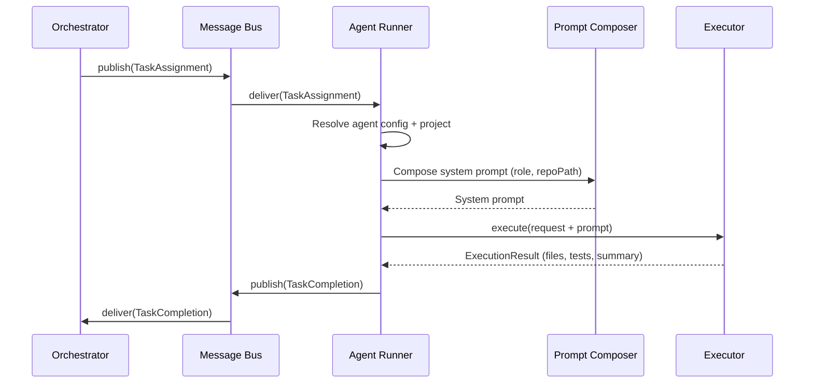
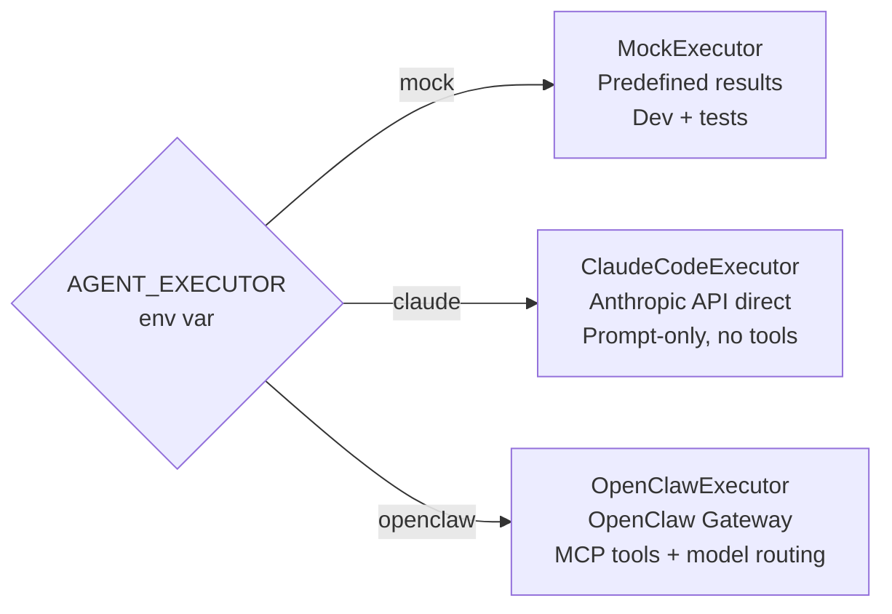

# Agent Execution Model

This document describes how Belva-GEN dispatches work to AI agents, how agents execute tasks, and how results flow back to the orchestrator.

## Why an Agent Abstraction

The system needs to work in three modes: development (no API calls), direct Anthropic API (prompt-only), and production with MCP tools (OpenClaw). An executor abstraction isolates the orchestrator from execution details, making the system testable and extensible without changing any orchestration logic.

## Execution Flow

The runner resolves the agent configuration, composes a system prompt appropriate to the executor type, calls the executor, and publishes the result back through the message bus. The orchestrator never interacts with the executor directly.

## Agent Registry

The registry tracks agent configurations and runtime status. Each agent has:

- **Role** — Maps to an agent definition file (e.g., `backend`, `frontend`, `testing`, `orchestrator`)
- **Capabilities** — Task types it can handle, max concurrent tasks
- **Preferred model** — Which LLM to use (e.g., Opus for orchestration, Sonnet for implementation)
- **Status** — Runtime state: `idle`, `busy`, `error`, `offline`

Agents are registered per project. The orchestrator maps task types to agent roles when dispatching work.

## Executor Abstraction

The `AgentExecutor` interface defines two methods: `execute(request, signal)` and `healthCheck()`. Three implementations exist:

- **MockExecutor** — Returns predefined results. Used in development and tests. No external calls.
- **ClaudeCodeExecutor** — Calls the Anthropic API directly. Agents can reason and produce structured output, but have no tool access (can't read files, query Jira, or create PRs).
- **OpenClawExecutor** — Posts to the OpenClaw gateway, which provides MCP tool access, workspace isolation, and model routing. This is the production executor.

Selection is controlled by the `AGENT_EXECUTOR` environment variable. The factory instantiates the appropriate executor at startup.

## Prompt Composition

Every agent execution needs a system prompt. How that prompt is composed depends on the executor type. This dual-path design allows the system to serve both its own codebase (legacy path) and external project repos (OpenClaw path).

### Legacy Path (ClaudeCodeExecutor)

Reads agent definitions from `.claude/agents/{agentId}.md` and filters `.claude/rules/*.md` by whether the task's domain paths match each rule's `appliesTo` patterns. Rules are automatically included — a backend task touching server code picks up infrastructure and async-concurrency rules without explicit configuration.

### OpenClaw Path (OpenClawExecutor)

Reads from the target project's repository:

1. Resolve the project from the task's pipeline
2. Read `{project.repoPath}/openclaw/agents/{role}.md` — the agent's specialized definition
3. Read `{project.repoPath}/openclaw/SOUL.md` — project-wide constraints
4. Concatenate into a focused, project-specific prompt (~250 lines)

The key design rule: **our layer composes the prompt, the executor just executes it.** OpenClaw never assembles prompts or reads agent definitions. This keeps prompt logic centralized and testable.

If no OpenClaw agent definitions exist for a project, the system falls back to the legacy path.

## Message Protocol

All communication between the orchestrator and agents flows through a typed message bus. Every message is Zod-validated at publish and delivery time.

| Message | Direction | Purpose |
|---------|-----------|---------|
| TaskAssignment | Orchestrator → Agent | Assigns work with constraints and acceptance criteria |
| TaskCompletion | Agent → Orchestrator | Reports results (changed files, test requirements, summary) |
| GateCheckRequest | Orchestrator → Agent | Requests gate validation |
| GateCheckResult | Agent → Orchestrator | Returns gate pass/fail with violations |
| HumanApprovalRequest | Orchestrator → Dashboard | Requests human review of a plan |
| HumanApprovalResponse | Dashboard → Orchestrator | Human's approve/reject/revision decision |
| StatusUpdate | Any → Any | Progress notifications |

## Git Isolation

Each agent execution operates in an isolated git worktree on a dedicated branch. This prevents concurrent agents from conflicting with each other or with the main branch. Branch naming follows project conventions (e.g., `feature/BELVA-XXX-task-N-description`).

## Concurrency Control

Concurrency is limited at three levels:

1. **Per agent** — Each agent has a `maxConcurrentTasks` setting (default 1)
2. **Per epic** — A configurable limit on parallel tasks within a single epic (default 3)
3. **Global** — The agent-tasks queue has a concurrency cap

Before parallel dispatch, the scheduler checks for overlapping affected files between tasks at the same dependency level. Overlapping tasks are serialized to prevent merge conflicts.

## Abort Protocol

When a task is blocked, the system evaluates the blocker type and chooses a response:

- **Dependency blocker** — Wait for the upstream task, then resume
- **Error blocker** — Retry with accumulated error context (up to max retries)
- **Complexity blocker** — Escalate to human with context about what's too complex
- **Timeout** — Publish a timeout result; orchestrator decides whether to retry or escalate

The orchestrator applies these decisions based on pipeline type — bug pipelines retry aggressively, feature pipelines preserve independent work and notify humans about failures.

## Error Handling

| Failure | Detection | Response |
|---------|-----------|---------|
| Timeout | `AbortSignal.timeout()` | TaskCompletion with `status: "timeout"` |
| API error | Circuit breaker on external calls | Retry with exponential backoff; circuit opens after repeated failures |
| Bad output | Zod validation of ExecutionResult | TaskCompletion with `status: "failed"` and error context |

## Related Documents

- [System Overview](system-overview.md) — Where agents fit in the system
- [Multi-Project & OpenClaw](multi-project-and-openclaw.md) — Per-repo agent definitions and OpenClaw integration
- [Pipeline Architecture](pipeline-architecture.md) — How pipelines dispatch to agents
- [Governance Model](governance-model.md) — Gates that validate agent output
