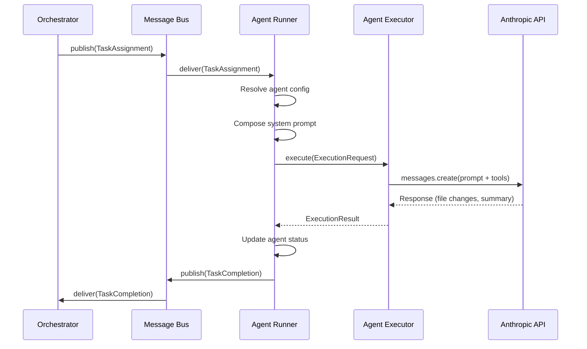
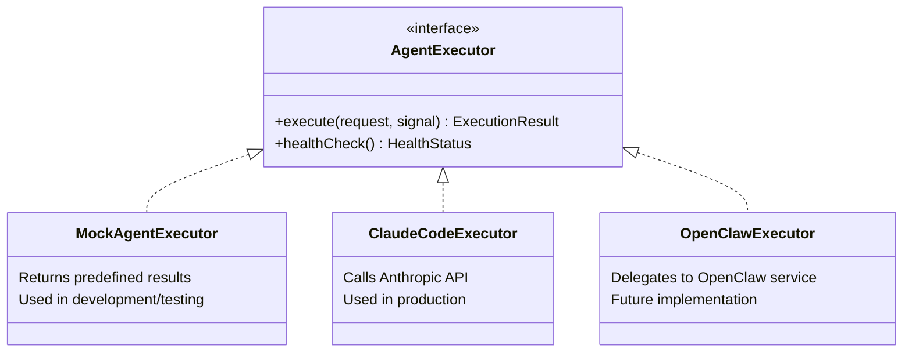

# Agent Execution Model

This document describes how Belva-GEN dispatches work to AI agents, how agents execute tasks, and how results flow back to the orchestrator.

## Why an Agent Abstraction

The system needs to work in three modes: development (no API calls), production (Anthropic Claude), and potentially future runtimes (OpenClaw, other LLM providers). An executor abstraction isolates the orchestrator from execution details, making the system testable and extensible.

## Execution Flow

## Agent Registry

The registry (`src/server/agents/registry.ts`) tracks agent configurations and runtime status.

Each agent has:
- **`agentId`** — Unique identifier matching the `.claude/agents/<id>.md` file
- **`capabilities`** — Task types it can handle, max concurrent tasks
- **`ownedPaths`** — File paths this agent is allowed to read/modify (domain boundary)
- **`status`** — Runtime state: `idle`, `busy`, `error`, `offline`

Agent definitions live in `.claude/agents/*.md`. These serve dual purpose: human documentation and LLM system prompts.

## Agent Resolution

When the orchestrator needs to assign a task, it maps `taskType` to an agent:

| Task Type | Agent | Rationale |
|-----------|-------|-----------|
| `backend` | `node-backend` | APIs, database, queues, server logic |
| `frontend` | `next-ux` | React components, dashboard pages |
| `testing` | `ts-testing` | Test files, coverage, E2E |
| `documentation` | `orchestrator-project` | Cross-cutting concerns |
| `orchestration` | `orchestrator-project` | Workflow, coordination |

Resolution happens in the orchestrator engine and in `src/server/orchestrator/task-graph.ts` via `resolveAgentForTask()`. The bug pipeline uses a text-heuristic variant in `src/server/orchestrator/triage.ts` that scans ticket description for path keywords.

## Message Bus

The message bus (`src/server/agents/message-bus.ts`) provides typed pub/sub communication between the orchestrator and agents. All messages are Zod-validated.

Key message types (defined in `src/types/agent-protocol.ts`):

| Message | Direction | Purpose |
|---------|-----------|---------|
| `TaskAssignment` | Orchestrator → Agent | Assigns work with constraints and acceptance criteria |
| `TaskCompletion` | Agent → Orchestrator | Reports results (changed files, test requirements, summary) |
| `GateCheckRequest` | Orchestrator → Agent | Requests gate validation |
| `GateCheckResult` | Agent → Orchestrator | Returns gate pass/fail with violations |
| `HumanApprovalRequest` | Orchestrator → Dashboard | Requests human review of a plan |
| `HumanApprovalResponse` | Dashboard → Orchestrator | Human's approve/reject/revision decision |
| `StatusUpdate` | Any → Any | Progress notifications |

## Executor Abstraction

The `AgentExecutor` interface (`src/server/agents/execution/types.ts`) defines two methods:

- **`execute(request, signal)`** — Run a task, return results
- **`healthCheck()`** — Report executor readiness

Three implementations:

Selection is controlled by `AGENT_EXECUTOR` env var (`mock`, `claude`, `openclaw`). Factory in `src/server/agents/execution/index.ts`.

## System Prompt Composition

Each agent execution builds a system prompt from two sources:

1. **Agent definition** — `.claude/agents/<agentId>.md` defines the agent's role, constraints, and expertise
2. **Applicable rules** — `.claude/rules/*.md` files are included based on whether the task's `domainPaths` match the rule's `appliesTo` patterns

The prompt composer (`src/server/agents/execution/prompt-composer.ts`) assembles these into a single prompt. This means agents automatically receive relevant rules (e.g., `ts-strict-mode.md` for TypeScript files, `accessibility.md` for component files) without explicit configuration.

## Execution Request and Result

**ExecutionRequest** contains everything the executor needs:

- `taskId`, `agentId`, `taskType`, `ticketRef` — Identity
- `description` — What to do
- `constraints` — Rules the agent must follow
- `acceptanceCriteria` — How to verify success
- `domainPaths` — Which files the agent may touch
- `systemPrompt` — Composed from agent definition + rules
- `priorResults` — Context from previous attempts (for retry loops)
- `timeoutMs` — Execution deadline

**ExecutionResult** is what comes back:

- `status` — `completed`, `failed`, or `timeout`
- `changedFiles` — List of modified file paths
- `testRequirements` — Tests the agent recommends running
- `summary` — What was done and why
- `durationMs` — Execution time

Both types are Zod-validated schemas in `src/server/agents/execution/types.ts`.

## Git Isolation

Each agent execution operates in an isolated git worktree on a dedicated branch. This prevents concurrent agents from conflicting with each other or with the main branch.

Branch naming follows `git-safety.md`:
- Bug fixes: `fix/BELVA-XXX-auto-fix`
- Feature tasks: `feature/BELVA-XXX-task-N-description`

## Concurrency Control

Concurrency is limited at two levels:

1. **Per agent** — `AgentConfig.capabilities.maxConcurrentTasks` (default 1). The runner checks this before dispatching.
2. **Per epic** — `OrchestratorConfig.maxConcurrentTasksPerEpic` (default 3). The parallel executor enforces this.
3. **Global** — BullMQ `agent-tasks` queue concurrency (currently 3).

## Error Handling

Three failure modes, each handled differently:

| Failure | Detection | Response |
|---------|-----------|----------|
| **Timeout** | `AbortSignal.timeout()` | Publish `TaskCompletion` with `status: "timeout"` |
| **API error** | Circuit breaker on Anthropic calls | Retry with exponential backoff; circuit opens after 5 failures |
| **Bad output** | Zod validation of `ExecutionResult` | Publish `TaskCompletion` with `status: "failed"` and error context |

The orchestrator decides what to do with failures based on the pipeline type:
- **Bug pipeline** — Retry with accumulated error context
- **Feature pipeline** — Block dependent tasks, continue independent ones, notify human

## Key Files

| File | Purpose |
|------|---------|
| `src/server/agents/registry.ts` | Agent configuration and status tracking |
| `src/server/agents/runner.ts` | Receives `TaskAssignment`, invokes executor, publishes `TaskCompletion` |
| `src/server/agents/message-bus.ts` | Typed pub/sub with Zod validation |
| `src/server/agents/execution/types.ts` | `ExecutionRequest`, `ExecutionResult`, `AgentExecutor` interface |
| `src/server/agents/execution/mock-executor.ts` | Development/test executor |
| `src/server/agents/execution/claude-executor.ts` | Production executor via Anthropic API |
| `src/server/agents/execution/prompt-composer.ts` | Builds system prompts from agent defs + rules |
| `src/types/agent-protocol.ts` | Message type schemas (`TaskAssignment`, `TaskCompletion`, etc.) |
| `.claude/agents/*.md` | Agent definitions (role, constraints, owned paths) |

## Related Documents

- [System Overview](system-overview.md) — Where agents fit in the system
- [Pipeline Architecture](pipeline-architecture.md) — How pipelines dispatch to agents
- [Governance Model](governance-model.md) — Gates that validate agent output
