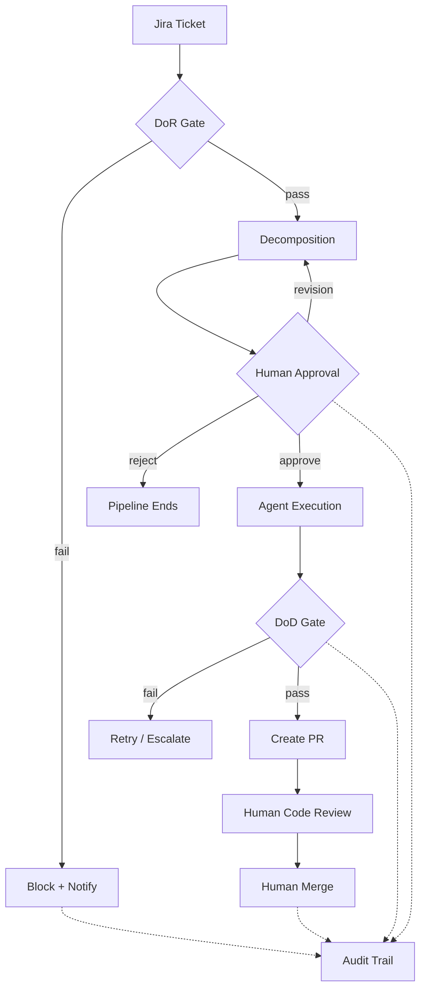
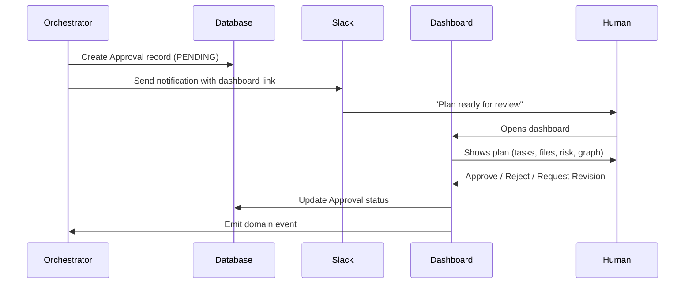

# Governance Model

Belva-GEN enforces quality and safety at every stage of the development lifecycle through gates, approvals, and an audit trail. The core invariant: **no code reaches production without human approval**.

## Why Governance Matters

Autonomous agents can generate code fast, but speed without quality is dangerous. The governance model exists to:

1. **Prevent bad work from starting** — DoR gates reject underspecified tickets
2. **Prevent bad code from shipping** — DoD gates validate test, lint, and security results
3. **Keep humans in control** — Mandatory approval before execution; mandatory review before merge
4. **Provide accountability** — Full audit trail of every gate decision and approval action

## Governance Flow

## Definition of Ready (DoR)

The DoR gate validates that a ticket is well-defined enough for agents to work on. It runs **before** any decomposition or agent execution.

### Standard DoR Rules

Applied to features and high-complexity bugs:

| Rule | What It Checks | Severity |
|------|----------------|----------|
| `bdd-format` | Acceptance criteria follow Given/When/Then | error |
| `story-points-required` | Story points are estimated | error |
| `story-points-fibonacci` | Points are valid Fibonacci (1, 2, 3, 5, 8, 13) | error |
| `story-points-large` | Points > 8 trigger a "consider splitting" warning | warning |
| `out-of-scope-section` | Description includes an Out-of-Scope section | error |
| `title-length` | Title under 100 characters | error |
| `bug-reproduction-steps` | Bug tickets include repro steps | error |
| `bug-expected-actual` | Bug tickets include expected vs actual | error |

### Bug-Specific DoR Rules

Simplified for low-complexity bugs (1-2 points):

| Rule | What It Checks | Severity |
|------|----------------|----------|
| `bug-repro-steps` | Description has reproduction steps | error |
| `bug-expected-actual` | Description has expected and actual behavior | error |
| `bug-affected-area` | Description references affected file or component | warning |
| `bug-story-points` | Story points are present | error |
| `bug-gen-label` | GEN label is present | error |

### Design: Rules as Predicates

Each rule is a pure function: `(ticket: JiraTicket) => GateViolation | null`. This makes rules independently testable, composable, and extensible.

A gate **passes** if zero `error`-severity violations exist. `warning` violations are included in the result but don't block.

**Key files:**
- `src/server/services/gates/dor-rules.ts` — Standard DoR rule predicates
- `src/server/services/gates/dor-validation.ts` — `evaluateDoR()` aggregation
- `src/server/services/bug-dor.ts` — Bug-specific DoR rules
- `src/types/gates.ts` — `GateResult`, `GateViolation` schemas

## Human Approval

**Non-negotiable rule: No automatic approval under any circumstances — not even on timeout.**

### Approval Flow

### What the Human Sees

The approval screen presents:
- **Plan summary** — Task count, estimated points, risk level
- **Affected files** — Complete list of files that will be modified
- **Dependency graph** — Mermaid visualization of task dependencies
- **Risk areas** — Identified by the LLM during decomposition
- **Plan hash** — SHA-256 for integrity verification (ensures the approved plan is exactly what executes)

### Approval Actions

| Action | Effect |
|--------|--------|
| **Approve** | Orchestrator begins execution. Plan hash is verified. |
| **Reject** | Pipeline ends. Ticket status updated in Jira. |
| **Request Revision** | Orchestrator re-decomposes with reviewer feedback. Revision count incremented. |

### Revision Limits

Max 3 revision cycles (configurable via `OrchestratorConfig.maxRevisionCycles`). After exceeding the limit, the approval is marked `ESCALATED` and a supervisor is notified. This prevents infinite loops between reviewer and system.

### Expiration Handling

When an approval reaches `expiresAt`:
1. A reminder is sent to Slack
2. `expiresAt` is extended by 24 hours
3. Status remains `PENDING`
4. An audit log entry is created

**The system never auto-approves.** This is the most critical governance rule.

**Key files:**
- `src/server/services/approval.service.ts` — Approval CRUD and event emission
- `src/server/orchestrator/plan-summary.ts` — Plan summary generation with risk assessment
- `src/server/workers/expiration-checker.ts` — Hourly cron for expiration handling
- `src/app/dashboard/approvals/page.tsx` — Approval UI
- `prisma/schema.prisma` — `Approval` model with `planHash`, `revisionHistory`, `expiresAt`

## Definition of Done (DoD)

The DoD gate validates that agent output meets quality standards. It runs **after** agent execution, **before** PR creation.

### DoD Rules

| Rule | What It Checks | Severity |
|------|----------------|----------|
| `test-results-required` | Test results are provided | error |
| `tests-passing` | Zero failing tests | error |
| `no-skipped-tests` | No `.skip()` / `.only()` / `.todo()` | error |
| `coverage-threshold` | Coverage meets minimum (80% server, 70% app) | error |
| `test-budget` | Tests complete within 3s budget | warning |
| `security-scan-required` | Security scan results provided | warning |
| `security-violations` | No error-severity security findings | error |
| `lint-errors` | Zero lint errors | error |
| `lint-warnings` | Lint warnings flagged for awareness | warning |

### Design: Changeset-Based Validation

The DoD gate operates on a `Changeset` — a snapshot of the agent's output that includes:
- `ticketRef` and `branchName`
- `changedFiles` — What was modified
- `testResults` — Pre-computed by the test executor
- `lintResults` — Pre-computed by the lint runner
- `securityScan` — Pre-computed by the security scanner

The DoD service validates these values; it doesn't run tests itself. The test executor (`src/server/lib/test-executor.ts`) runs in the agent's worktree and produces the results that feed into the changeset.

**Key files:**
- `src/server/services/gates/dod-rules.ts` — DoD rule predicates
- `src/server/services/gates/dod-validation.ts` — `evaluateDoD()` aggregation
- `src/types/gates.ts` — `Changeset`, `TestResults`, `LintResults`, `SecurityScanResult` schemas

## Audit Trail

Every gate decision — pass or fail — is recorded in the `AuditLog` table with the full `GateResult` as JSON payload. This provides:

- **Compliance** — Complete record of why work was approved or blocked
- **Debugging** — Trace back to understand why a pipeline took a particular path
- **Metrics** — Analyze gate pass rates, common failure reasons, approval latency

Audit entries include: `action` (e.g., `gate.dor.passed`), `entityType`, `entityId` (ticket ref), `agentId`, and full `payload`.

**Key files:**
- `src/server/services/gates/audit.ts` — `logGateDecision()` helper
- `prisma/schema.prisma` — `AuditLog` model

## Security Scanning

Phase 1 (current): Regex-based detection for:
- Hardcoded secrets (API keys, tokens, passwords)
- Dangerous patterns (`eval`, `dangerouslySetInnerHTML`, `innerHTML`)

Phase 2 (future): `eslint-plugin-security`, `npm audit` integration.

Security findings at `error` severity block the DoD gate. Findings at `warning` severity are informational.

## Related Documents

- [System Overview](system-overview.md) — Where governance fits in the system
- [Pipeline Architecture](pipeline-architecture.md) — How gates integrate with pipelines
- [Service Layer & API](service-layer-api.md) — How approval actions flow through the API
