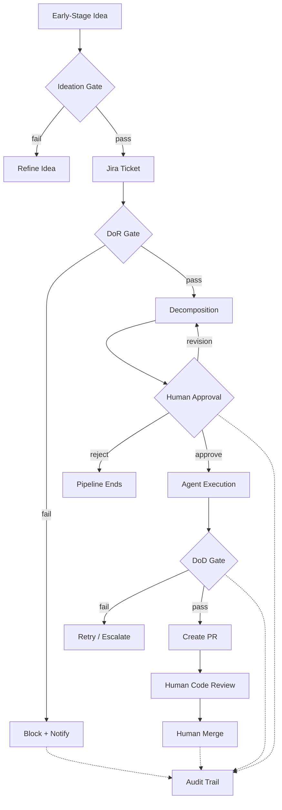
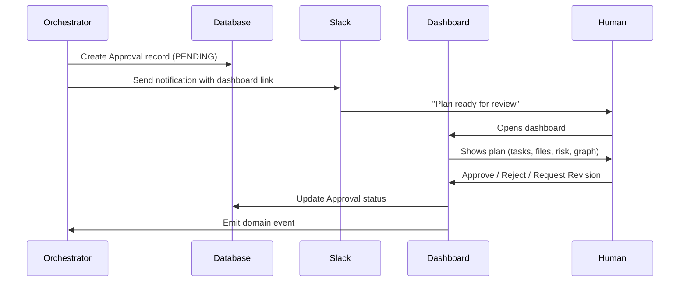

# Governance Model

Belva-GEN enforces quality and safety at every stage of the development lifecycle through gates, approvals, and an audit trail. The core invariant: **no code reaches production without human approval**.

## Why Governance Matters

Autonomous agents can generate code fast, but speed without quality is dangerous. The governance model exists to:

1. **Prevent bad ideas from starting** — Ideation gates reject ideas without clear value
2. **Prevent bad work from starting** — DoR gates reject underspecified tickets
3. **Prevent bad code from shipping** — DoD gates validate test, lint, and security results
4. **Keep humans in control** — Mandatory approval before execution; mandatory review before merge
5. **Provide accountability** — Full audit trail of every gate decision and approval action

## Governance Flow

## Ideation Gate

The ideation gate validates that an idea has a clear problem statement, value hypothesis, and success metrics before it becomes a formal ticket. This is the softest gate — it catches vague or unmotivated work early, before anyone invests in specification.

**What it checks:**

- **Problem statement** — Is there a clear description of the problem or motivation?
- **Value hypothesis** — What impact will solving this have? Who benefits?
- **Success metrics** — How will we know this succeeded? Are criteria measurable?

Ideas that fail the ideation gate aren't rejected permanently — they're sent back for refinement with specific feedback about what's missing.

## Definition of Ready (DoR)

The DoR gate validates that a ticket is well-defined enough for agents to work on. It runs before any decomposition or agent execution.

### Standard DoR Rules

Applied to features and high-complexity bugs:

| Rule | What It Checks | Severity |
| ---- | -------------- | -------- |
| BDD format | Acceptance criteria follow Given/When/Then | error |
| Story points required | Story points are estimated | error |
| Story points Fibonacci | Points are valid Fibonacci (1, 2, 3, 5, 8, 13) | error |
| Large story warning | Points > 8 trigger "consider splitting" | warning |
| Out-of-scope section | Description includes Out-of-Scope | error |
| Title length | Title under 100 characters | error |
| Bug repro steps | Bug tickets include reproduction steps | error |
| Bug expected/actual | Bug tickets include expected vs actual | error |

### Design: Rules as Predicates

Each rule is a pure function: `(ticket) → violation | null`. This makes rules independently testable, composable, and extensible. A gate passes if zero error-severity violations exist. Warnings are included in the result but don't block.

### Bug-Specific DoR

Low-complexity bugs (1–2 points) use a simplified ruleset: reproduction steps, expected vs actual behavior, affected area, story points, and GEN label. This avoids over-specifying simple fixes.

## Human Approval

**Non-negotiable rule: No automatic approval under any circumstances — not even on timeout.**

### Approval Flow

### What the Human Sees

The approval screen presents: task count, estimated points, risk level, affected files, a dependency graph visualization, identified risk areas, and a plan hash (SHA-256 for integrity verification — the approved plan is exactly what executes).

### Approval Actions

| Action | Effect |
| ------ | ------ |
| **Approve** | Execution begins. Plan hash is verified. |
| **Reject** | Pipeline ends. Ticket status updated in Jira. |
| **Request Revision** | Re-decomposition with reviewer feedback. Revision count incremented. |

### Revision Limits

Max revision cycles (configurable, default 3). After exceeding the limit, the approval is marked `ESCALATED` and a supervisor is notified. This prevents infinite loops between reviewer and system.

### Expiration Handling

When an approval reaches its expiry time: a reminder is sent to Slack, the expiry is extended by 24 hours, status remains `PENDING`, and an audit entry is created. **The system never auto-approves.**

## Definition of Done (DoD)

The DoD gate validates that agent output meets quality standards. It runs after agent execution, before PR creation.

### DoD Rules

| Rule | What It Checks | Severity |
| ---- | -------------- | -------- |
| Test results required | Test results are provided | error |
| Tests passing | Zero failing tests | error |
| No skipped tests | No `.skip()` / `.only()` / `.todo()` | error |
| Coverage threshold | Meets minimum (80% server, 70% app) | error |
| Test budget | Tests complete within 3s budget | warning |
| Security scan required | Security scan results provided | warning |
| Security violations | No error-severity security findings | error |
| Lint errors | Zero lint errors | error |

### Design: Changeset-Based Validation

The DoD gate operates on a changeset — a snapshot of the agent's output that includes changed files, pre-computed test results, lint results, and security scan results. The DoD service validates these values; it doesn't run tests itself. The test executor runs in the agent's worktree and produces the results that feed into the changeset.

## Audit Trail

Every gate decision — pass or fail — is recorded with the full gate result as a JSON payload. This provides compliance (complete record of why work was approved or blocked), debugging (trace why a pipeline took a particular path), and metrics (gate pass rates, failure reasons, approval latency).

## Knowledge Extraction

After pipelines complete, the system extracts patterns from the work: what succeeded, what failed, what required retries, what humans corrected during review. These observations are stored as searchable knowledge entries per project. Patterns that prove consistently valuable can be promoted to shared knowledge or codified as rules — creating a feedback loop where the system improves from its own experience.

## Security Scanning

**Current capabilities:** Regex-based detection for hardcoded secrets (API keys, tokens, passwords) and dangerous patterns (`eval`, `dangerouslySetInnerHTML`, `innerHTML`). Security findings at error severity block the DoD gate.

**Planned capabilities:** Integration with `eslint-plugin-security` and `npm audit` for deeper static analysis and dependency vulnerability scanning.

## Related Documents

- [System Overview](system-overview.md) — Where governance fits in the system
- [Pipeline Architecture](pipeline-architecture.md) — How gates integrate with pipelines
- [Integrations & Infrastructure](integrations-and-infrastructure.md) — How Slack notifications support the approval flow
