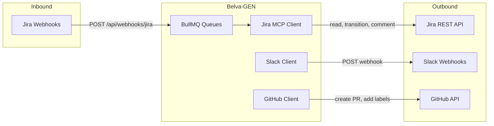
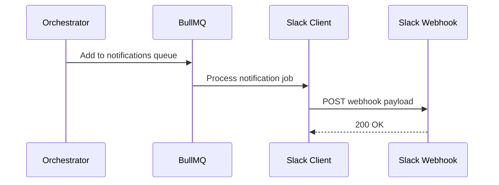
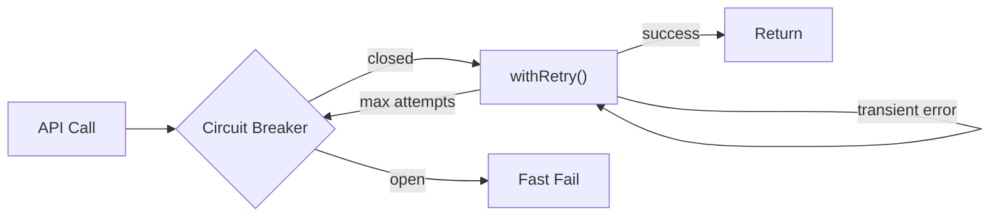

# Integration Layer

Belva-GEN integrates with three external systems: Jira (work intake), Slack (notifications), and GitHub (code output). Each integration follows a consistent pattern: typed client, Zod-validated schemas, circuit breaker resilience, and queue-based async processing.

## Integration Map

## Jira Integration

### Why Jira

Jira is the source of truth for work items. The system reads tickets to understand what needs to be built, transitions ticket status to reflect pipeline progress, and adds comments to document automated actions.

### How It Works

**Inbound (webhooks):**

1. Jira sends webhooks to `POST /api/webhooks/jira`
2. The route reads the raw body first (for optional HMAC signature verification), then parses JSON
3. The payload is validated with `JiraWebhookPayloadSchema` and enqueued to BullMQ's `webhook-processing` queue
4. The webhook worker processes the event asynchronously, checking for the `GEN` label to determine if the ticket should enter the pipeline

**Outbound (REST API):**

| Operation | Method | Safety | Purpose |
|-----------|--------|--------|---------|
| `getTicket(key)` | `GET /rest/api/3/issue/{key}` | Safe | Read ticket details for triage and DoR |
| `searchTickets(jql)` | `GET /rest/api/3/search` | Safe | Poll for GEN-labeled tickets (webhook fallback) |
| `transitionTicket(key, transitionId)` | `POST /rest/api/3/issue/{key}/transitions` | Safe | Update ticket status as pipeline progresses |
| `addComment(key, body)` | `POST /rest/api/3/issue/{key}/comment` | Safe | Document automated actions (PR links, escalations) |

Full-content description updates are **forbidden** per `mcp-safety.md` — the context window is not a lossless transport layer.

**Authentication:** Basic Auth with `JIRA_USER_EMAIL:JIRA_API_TOKEN` base64-encoded.

**Response transformation:** Jira's nested API format (`fields.status.name`) is mapped to a flat `JiraTicket` type via explicit mapping functions. All mapped responses are validated with Zod schemas.

**JQL injection prevention:** `searchTickets()` validates the project key matches `/^[A-Z]+$/` before building JQL queries.

**Key files:**
- `src/server/mcp/jira/client.ts` — `JiraMCPClient` with all operations
- `src/server/mcp/jira/schemas.ts` — `JiraTicketSchema`, `JiraWebhookPayloadSchema`
- `src/server/mcp/jira/types.ts` — `JiraTicket` flat type, response mapping functions
- `src/server/mcp/jira/index.ts` — Lazy singleton with circuit breaker
- `src/app/api/webhooks/jira/route.ts` — Webhook endpoint

## Slack Integration

### Why Slack

Slack is the notification channel. Humans are notified when plans need approval, when pipelines complete or fail, and when approvals expire. Slack messages link to the dashboard where all actions are taken.

### How It Works

Belva-GEN uses **Slack Incoming Webhooks** — the simplest integration model. No bot token, no OAuth, no interactive components. This is a one-way notification system.

**Message types:**

| Type | When | Content |
|------|------|---------|
| Approval request | Plan decomposed | Ticket ref, risk level, dashboard link |
| Status update | Pipeline approved/rejected/completed/failed | Status emoji + message |
| Expiration reminder | Approval nearing/past expiry | Reminder + dashboard link |
| Escalation | Bug fix failed / revision limit exceeded | Failure context + action needed |

**Why webhooks, not Bot API:** Simpler setup (no OAuth, no signing secret), no attack surface (system sends, never receives), sufficient for MVP. The dashboard handles all approval actions. Can upgrade to full bot later if inline approve/reject buttons are needed.

**Rate limiting:** Messages go through BullMQ's `notifications` queue, which provides natural rate limiting (Slack allows ~1 message/second for webhooks).

**Key files:**
- `src/server/mcp/slack/client.ts` — `SlackNotificationClient.send()`
- `src/server/mcp/slack/messages.ts` — `buildApprovalRequestPayload()`, `buildStatusUpdatePayload()`
- `src/server/mcp/slack/schemas.ts` — `SlackWebhookPayloadSchema`
- `src/server/mcp/slack/index.ts` — Lazy singleton

## GitHub Integration

### Why GitHub

GitHub is the code output destination. The system creates pull requests for human review and merge. It never pushes directly to main or auto-merges.

### How It Works

Uses `@octokit/rest` to interact with the GitHub API.

**Operations:**

| Operation | Purpose |
|-----------|---------|
| `pulls.create()` | Create PR from agent's feature branch to main |
| `issues.addLabels()` | Add `auto-fix`, `GEN`, task-type labels to PR |

**Branch naming:**
- Bug fixes: `fix/BELVA-XXX-auto-fix`
- Feature tasks: `feature/BELVA-XXX-task-N-description`

**PR body includes:** Ticket reference, agent summary, changed files list, attempt count, test plan checklist.

**Authentication:** `GITHUB_TOKEN` (PAT or GitHub App token).

**Key files:**
- `src/server/services/pr.service.ts` — `createPullRequest()`, `buildPRBody()`

## Resilience Patterns

All external API calls follow the same resilience pattern:

**Circuit breaker:** Opens after 5 consecutive failures. 30-second cooldown before half-open probe. Prevents cascading failures when an external service is down.

**Retry with backoff:** Exponential backoff starting at 1 second, max 3 attempts. Handles transient network errors and rate limits.

**AbortSignal:** All async operations accept `AbortSignal` for timeout control, per `async-concurrency.md`.

These patterns are defined in `src/server/lib/circuit-breaker.ts` and `src/server/lib/retry.ts`.

## Queue Architecture

All external interactions flow through BullMQ queues for reliability:

| Queue | Purpose | Retry Policy |
|-------|---------|--------------|
| `webhook-processing` | Inbound Jira webhooks | 3 attempts, exponential backoff |
| `agent-tasks` | Agent execution jobs | 3 attempts, 5-minute timeout |
| `notifications` | Outbound Slack messages | 3 attempts, exponential backoff |

Dead letter queues capture jobs that exhaust retries for manual inspection.

**Key files:**
- `src/server/queues/index.ts` — Queue definitions with typed job data schemas
- `src/server/workers/index.ts` — Worker implementations

## Environment Variables

| Variable | Service | Purpose |
|----------|---------|---------|
| `JIRA_BASE_URL` | Jira | API base URL |
| `JIRA_USER_EMAIL` | Jira | Basic Auth email |
| `JIRA_API_TOKEN` | Jira | Basic Auth token |
| `JIRA_PROJECT_KEY` | Jira | Project key for JQL queries |
| `WEBHOOK_SECRET` | Jira | Optional HMAC verification |
| `SLACK_WEBHOOK_URL` | Slack | Incoming Webhook URL |
| `GITHUB_TOKEN` | GitHub | API authentication |
| `GITHUB_REPO` | GitHub | Target repository (`owner/repo`) |
| `ANTHROPIC_API_KEY` | Anthropic | LLM API key |
| `ANTHROPIC_MODEL` | Anthropic | Model ID (default: `claude-sonnet-4-20250514`) |

All env vars are validated with Zod in `src/server/config/env.ts`. Optional vars gracefully degrade (e.g., missing `SLACK_WEBHOOK_URL` disables notifications).

## Related Documents

- [System Overview](system-overview.md) — How integrations fit in the system
- [Pipeline Architecture](pipeline-architecture.md) — How webhooks trigger pipelines
- [Governance Model](governance-model.md) — How Slack notifications support the approval flow
