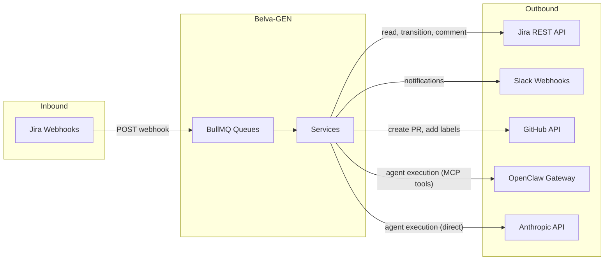
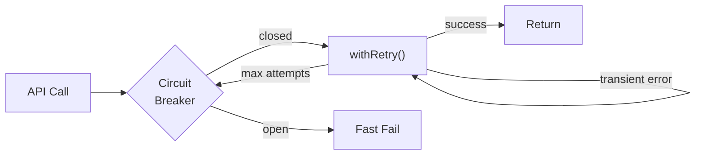

# Integrations & Infrastructure

Belva-GEN integrates with five external systems and runs on a straightforward AWS stack. This document covers what we talk to, how we stay resilient, and where it all runs.

## Integration Map



## Jira

Jira is the source of truth for work items. Inbound: Jira sends webhooks when tickets change — these are validated, enqueued, and processed asynchronously. The system checks for the `GEN` label to decide whether a ticket enters the pipeline. Outbound: the system reads ticket details for triage, transitions ticket status as pipelines progress, and adds comments to document automated actions (PR links, escalations).

Full-content description updates are forbidden — the context window is not a lossless transport layer. Only targeted operations (read, transition, comment, add label) are permitted.

## Slack

Slack is a one-way notification channel. Humans are notified when plans need approval, when pipelines complete or fail, and when approvals expire. Messages link to the dashboard where all actions are taken.

The system uses Slack Incoming Webhooks — no bot token, no OAuth, no interactive components. This keeps the attack surface minimal. Messages flow through BullMQ's notifications queue, which provides natural rate limiting. If inline approve/reject buttons are needed later, upgrading to the full Bot API is straightforward.

## GitHub

GitHub is where code ships. The system creates pull requests from agent feature branches for human review and merge. It never pushes directly to main or auto-merges. PR bodies include the ticket reference, agent summary, changed files, and a test plan checklist.

## OpenClaw

OpenClaw is the production agent executor. It provides MCP tool access (filesystem, Jira, GitHub), workspace isolation, and per-agent model routing. The system posts to the gateway's chat completions endpoint with a fully composed system prompt. OpenClaw executes it and returns the result.

The gateway is configured with agent slots, each assigned specific MCP servers. Filesystem access is path-restricted per project. Agents are registered dynamically via `config.patch` RPC — no gateway restart needed.

See [Multi-Project & OpenClaw](multi-project-and-openclaw.md) for the full architectural picture.

## Anthropic API

The direct Anthropic API path is used when OpenClaw isn't available (development, fallback). Agents can reason and produce structured output but have no tool access. The system uses circuit breaker and retry wrapping on all API calls.

## Resilience Patterns

All external calls follow the same resilience pattern:



**Circuit breaker** opens after consecutive failures. A cooldown period follows before a half-open probe. This prevents cascading failures when an external service is down.

**Retry with backoff** uses exponential delays, handling transient network errors and rate limits.

**AbortSignal** is threaded through all async operations for timeout control.

## Queue Architecture

All external interactions and background work flow through BullMQ queues for reliability:

| Queue | Purpose | Retry Policy |
| ----- | ------- | ------------ |
| webhook-processing | Inbound Jira webhooks | 3 attempts, exponential backoff |
| agent-tasks | Agent execution jobs | 3 attempts, 5-minute timeout |
| notifications | Outbound Slack messages | 3 attempts, exponential backoff |
| knowledge-extraction | Pattern extraction from completed pipelines | 3 attempts, exponential backoff |

Dead letter queues capture jobs that exhaust retries for manual inspection. A repeatable job runs hourly to check for expiring approvals.

## Deployment Topology

```
                ┌─────────────────┐
                │   CloudFront    │
                │   (CDN/WAF)     │
                └────────┬────────┘
                         │
                ┌────────▼────────┐
                │   ALB (HTTPS)   │
                └────────┬────────┘
                         │
          ┌──────────────┼──────────────┐
          │              │              │
 ┌────────▼──────┐ ┌────▼──────┐ ┌────▼──────┐
 │  ECS Task 1   │ │ ECS Task 2│ │ ECS Task N│
 │  Next.js App  │ │ Next.js   │ │ Next.js   │
 │  + Workers    │ │ + Workers │ │ + Workers │
 └───────┬───────┘ └─────┬─────┘ └─────┬─────┘
         │               │              │
 ┌───────▼───────────────▼──────────────▼──────┐
 │                  VPC                         │
 │  ┌──────────┐  ┌──────────┐  ┌───────────┐  │
 │  │ RDS      │  │ElastiCache│  │ Secrets   │  │
 │  │PostgreSQL│  │ Redis 7  │  │ Manager   │  │
 │  └──────────┘  └──────────┘  └───────────┘  │
 │                                              │
 │  ┌──────────────────┐                        │
 │  │ OpenClaw Gateway │                        │
 │  │ (ECS or sidecar) │                        │
 │  └──────────────────┘                        │
 └──────────────────────────────────────────────┘
         │
 ┌───────▼──────────────────────────────┐
 │  External APIs                        │
 │  Anthropic · Jira · Slack · GitHub    │
 └───────────────────────────────────────┘
```

**Compute:** ECS Fargate, 1 vCPU / 2 GB per task, auto-scaling 2–6 tasks based on CPU and queue depth.

**Database:** RDS PostgreSQL 16 (db.t4g.medium), Multi-AZ in production, 7-day automated backups. Prisma migrations run as a one-off ECS task during deployment.

**Cache:** ElastiCache Redis 7 (cache.t4g.micro). Backs BullMQ queues, rate limiting, session cache, and SystemConfig cache.

**Secrets:** All credentials in AWS Secrets Manager, read at startup via IAM role integration.

**Networking:** VPC with public + private subnets across 2 AZs. ALB terminates HTTPS in public subnet. ECS tasks, RDS, ElastiCache, and OpenClaw Gateway in private subnet. NAT Gateway for outbound API calls.

**OpenClaw Gateway:** Runs as an ECS task or sidecar within the VPC. Needs outbound access to Anthropic API and inbound from the application ECS tasks.

## Deployment Pipeline

```
git push → GitHub Actions →
  1. Run tests (unit + E2E)
  2. Build Docker image
  3. Push to ECR
  4. Run Prisma migrations (one-off ECS task)
  5. Update ECS service (rolling deployment)
  6. Health check verification
```

Zero-downtime deployments via ECS rolling update. Automatic rollback if health checks fail. Docker images tagged with git SHA.

## Cost Estimate (Monthly)

| Service | Estimate |
| ------- | -------- |
| ECS Fargate (2 tasks) | ~$60 |
| RDS PostgreSQL (t4g.medium, Multi-AZ) | ~$130 |
| ElastiCache Redis (t4g.micro) | ~$15 |
| ALB | ~$20 |
| NAT Gateway | ~$35 |
| OpenClaw Gateway (1 task) | ~$30 |
| Secrets Manager + CloudWatch | ~$14 |
| **Total** | **~$304/mo** |

Anthropic API costs are usage-based and separate.

## Related Documents

- [System Overview](system-overview.md) — High-level system architecture
- [Multi-Project & OpenClaw](multi-project-and-openclaw.md) — OpenClaw integration details
- [Pipeline Architecture](pipeline-architecture.md) — How webhooks trigger pipelines
- [Governance Model](governance-model.md) — How Slack notifications support the approval flow
