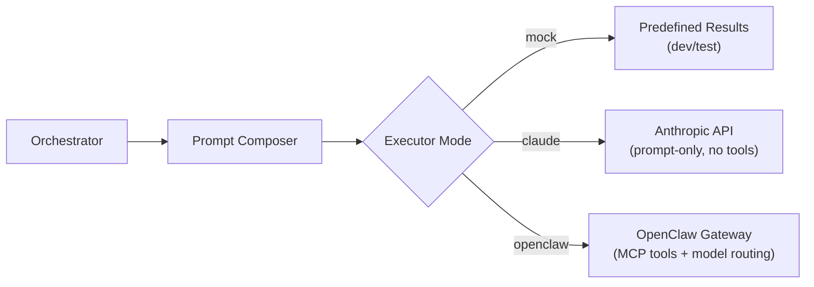

# Multi-Project Architecture & OpenClaw

Belva-GEN orchestrates AI agents across multiple codebases. Each project — a separate repository with its own Jira board, GitHub repo, and Slack channel — gets its own scoped pipeline, credentials, dashboard, and specialized agent definitions. OpenClaw is the production executor that gives agents real tools.

## Why Multi-Project

The original system assumed one project. In practice, the team manages multiple codebases (e.g., a Node.js/TypeScript service and a Django/Python service). Each has different tech stacks, conventions, and tooling. Agents working on a Django codebase shouldn't carry Node.js context in their prompt — it wastes the context window and confuses the model.

Multi-project support means:

- Each project owns its agent definitions, tuned to its stack
- Credentials are isolated and encrypted per project
- Dashboard views are scoped — you see one project's pipeline at a time
- Pipelines, approvals, and audit trails are project-scoped

## Project Model

Every project has:

- **Slug** — URL-friendly identifier (e.g., `belva-gen`, `belva-goat2`)
- **Integration config** — Jira base URL, project key, GitHub repo, Slack channel
- **Repo path** — Absolute path to the project's repository on disk, used at runtime to load agent definitions
- **Encrypted credentials** — Per-project secrets (API tokens, webhook URLs) encrypted with AES-256-GCM, each with its own IV and auth tag. Decrypted only when the orchestrator needs them

## Per-Repo Agent Definitions

This is the central architectural idea. Each project repository contains its own agent definitions:

```
any-project-repo/
  openclaw/
    agents/
      backend.md       # Specialized to THIS project's backend stack
      frontend.md      # Specialized to THIS project's frontend stack
      testing.md       # Specialized to THIS project's test tooling
      orchestrator.md  # Specialized to THIS project's Jira workflow
    SOUL.md            # Project-wide constraints (applies to all agents)
```

Each agent file is concise (~200 lines max) and contains only what that agent needs: identity, stack knowledge, rules, delegation boundaries, and tool permissions. A backend agent for a Node.js project knows Prisma and BullMQ. A backend agent for a Django project knows the async ORM and Celery. They never share context.

`SOUL.md` contains project-wide invariants — things like "zero `any` types" or "squash-merge only" — and is appended to every agent's prompt for that project.

### Why This Matters

- **No cross-stack waste** — agents carry only relevant context
- **No redeployment** — editing a markdown file in the repo changes the agent's behavior on the next execution
- **Repo-owned** — the team working on a project controls their own agent definitions
- **Versioned** — agent definitions travel with the code they describe

## Dynamic Loading

At execution time, the orchestrator resolves which project a task belongs to, reads the project's repo path, and loads the agent definition dynamically:

```
Task arrives → resolve pipeline → resolve project → read repoPath
  → load {repoPath}/openclaw/agents/{role}.md
  → load {repoPath}/openclaw/SOUL.md
  → compose system prompt
  → send to executor
```

If the project has no `openclaw/` directory, the system falls back to legacy agent definitions. This makes the transition gradual — projects opt in when ready.

## OpenClaw as Executor

OpenClaw is a local gateway service that gives agents MCP tool access (filesystem, Jira, GitHub), workspace isolation, and model routing. It does **not** compose prompts or make architectural decisions — it's a dumb executor.



**Three modes:**

- **mock** — Returns predefined results. Default for local dev and tests. No API calls.
- **claude** — Calls Anthropic API directly. Agents can reason but have no tools. Useful as a degraded fallback.
- **openclaw** — Production mode. Agents get MCP tools (read/write files, query Jira, create PRs), workspace isolation, and per-agent model routing.

**Key design rule:** Our orchestration layer composes the full system prompt and passes it to OpenClaw. OpenClaw never reads agent definitions or assembles prompts itself. This keeps prompt composition centralized and testable.

### Gateway Configuration

The gateway runs with a minimal config defining agent slots and their MCP server assignments. Agents are registered dynamically at startup via `config.patch` RPC — no gateway restart needed when agent definitions change.

Each agent slot specifies which MCP servers it can access (e.g., the orchestrator gets Jira and Slack; backend/frontend/testing agents get GitHub and filesystem). Filesystem access is path-restricted to the project's repo.

## Dashboard Scoping

All dashboard pages live under `/dashboard/[projectSlug]/`:

- **Overview** — Active epics, pending approvals, agent status, task throughput
- **Agents** — Agent configurations and runtime status for this project
- **Pipeline** — Kanban board of epics by lifecycle stage
- **Approvals** — Pending human reviews with plan details
- **Knowledge** — Extracted patterns and learnings from completed work
- **Settings** — Repo path, model preferences, MCP credentials, notification routing

A project selector in the sidebar lets users switch between projects.

## Emerging Services

The multi-project and OpenClaw architecture enabled several new capabilities:

- **Knowledge extraction** — After pipelines complete, the system extracts patterns (what worked, what failed, what was retried) and stores them as searchable knowledge entries per project. Valuable patterns can be promoted to shared knowledge or codified as rules.
- **Review synthesis** — Generates structured PR review verdicts by partitioning changes, checking against rules, and classifying severity.
- **Architecture review** — Validates decomposition plans against domain boundaries before execution begins.
- **PR chunking** — Splits large changesets into reviewable chunks based on domain boundaries, keeping PRs small and focused.

## Related Documents

- [Agent Execution Model](agent-execution-model.md) — How agents are dispatched, execute, and return results
- [System Overview](system-overview.md) — High-level system architecture
- [Governance Model](governance-model.md) — Quality gates and approval flow
