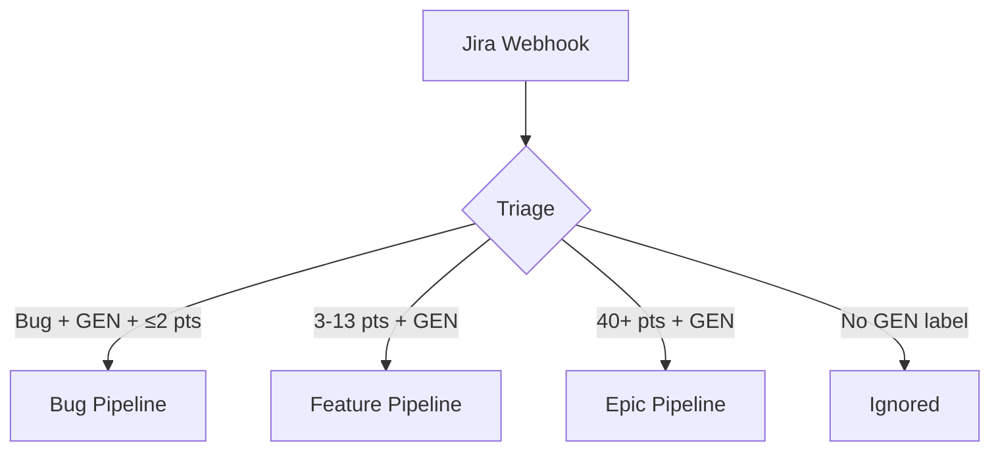
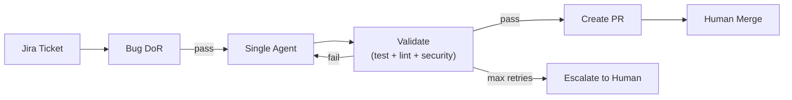
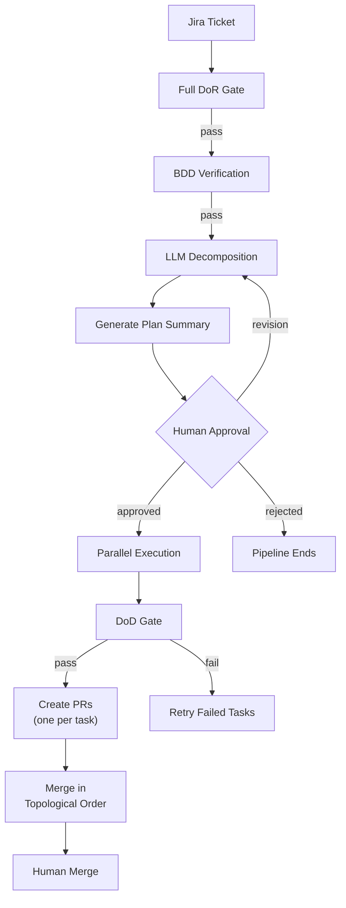
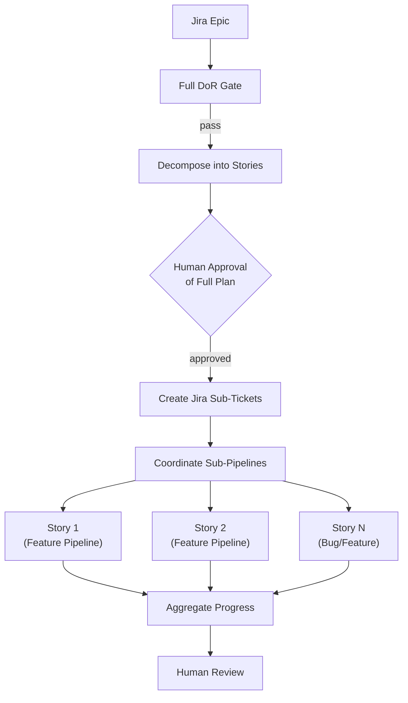
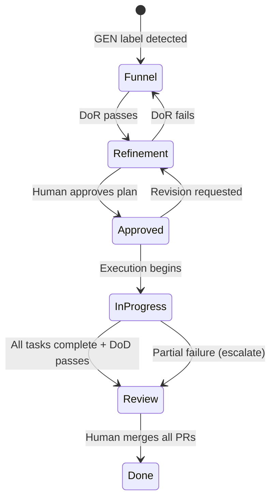
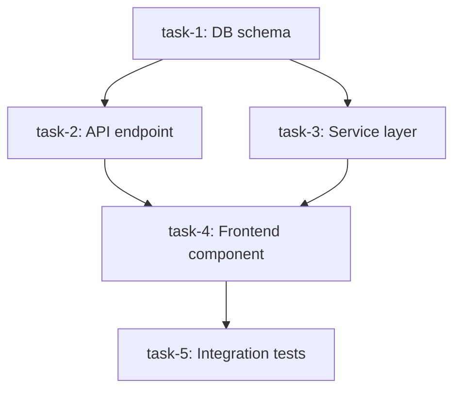

# Pipeline Architecture

Belva-GEN routes work through one of three pipelines based on ticket characteristics. Each pipeline enforces progressively more governance as complexity increases.

## Why Three Pipelines

Not all work needs the same level of oversight. A 1-point bug fix shouldn't require LLM decomposition and a human approval gate. Conversely, a 40-point epic shouldn't skip planning. The triage step classifies work and routes it to the appropriate pipeline, balancing speed against risk.

## Pipeline Selection

Triage logic lives in `src/server/orchestrator/triage.ts`. It examines three fields from the `JiraTicket`:

- **`issueType`** — "Bug" routes to the bug pipeline
- **`storyPoints`** — Determines complexity tier
- **`labels`** — Must include "GEN" to be eligible for automation

## Bug Pipeline (Stage 1)

The simplest path. A single agent attempts to fix the bug in an iterative loop. No LLM decomposition, no human approval before execution.

**Key design decisions:**

- **Bypasses planning gate** — Low-complexity bugs don't need decomposition
- **Iterative retry loop** — Each retry includes context from prior failures (changed files, test results, error messages) so the agent learns from mistakes
- **Escalation, not failure** — After max retries, the system notifies humans via Slack and Jira comment rather than silently failing
- **Never auto-merges** — PR is created; a human merges it

**Key files:**
- `src/server/orchestrator/bug-pipeline.ts` — `runBugFixLoop()` orchestrates the retry loop
- `src/server/services/bug-dor.ts` — Simplified DoR rules for bugs
- `src/server/lib/test-executor.ts` — Runs jest/lint/security in agent's worktree

## Feature Pipeline (Stage 2)

Features require BDD verification, LLM-powered task decomposition, mandatory human approval, and multi-agent parallel execution.

**Key design decisions:**

- **BDD first** — Acceptance criteria must be in Given/When/Then format before decomposition, ensuring the LLM has testable requirements to decompose against
- **Human approval is mandatory** — The plan (task graph, affected files, risk level, point estimate) is presented for review. No execution begins until a human approves
- **Revision cycles are bounded** — Max 3 revision requests before escalation, preventing infinite loops between reviewer and system
- **PR-per-task** — Each task in the dependency graph produces one PR, keeping changes small and reviewable
- **Topological merge ordering** — PRs are merged in dependency order to prevent conflicts

**Key files:**
- `src/server/services/bdd-verification.ts` — Parses and validates Given/When/Then scenarios
- `src/server/orchestrator/decomposer.ts` — LLM-powered decomposition via Anthropic SDK
- `src/server/orchestrator/parallel-executor.ts` — Concurrent execution respecting dependency graph
- `src/server/orchestrator/merge-sequencer.ts` — Topological sort for merge ordering
- `src/server/orchestrator/plan-summary.ts` — Human-readable plan with risk assessment

## Epic Pipeline (Stage 3)

Epics apply the full 6-stage lifecycle. The LLM decomposes the epic into user stories (each with BDD criteria), which then enter their own sub-pipelines.

**Key design decisions:**

- **Stories are independent pipelines** — Each decomposed story enters the feature (or bug) pipeline independently, enabling parallel work
- **Aggregate progress tracking** — The orchestrator tracks completion across all sub-pipelines via `Pipeline` + `TaskDecomposition` Prisma models
- **Graceful degradation** — When a task fails, only its dependents are blocked; independent tasks continue executing
- **No automatic rollback** — Successfully merged PRs stay merged. Reverting is a human decision

## Epic Lifecycle States

The state machine in `src/server/orchestrator/state-machine.ts` enforces this progression:

Each transition has guards (conditions that must be true) defined in the state machine. The orchestrator engine evaluates guards before allowing transitions.

## Task Dependency Graph

The decomposer produces a `TaskGraph` — a directed acyclic graph where nodes are tasks and edges are dependencies.

The parallel executor dispatches all tasks whose dependencies are satisfied, up to the concurrency limit (`maxConcurrentTasksPerEpic`, default 3). As tasks complete, newly unblocked tasks are dispatched.

**Key files:**
- `src/server/orchestrator/task-graph.ts` — `TaskGraph` schema, topological sort, ready-node detection
- `src/server/orchestrator/types.ts` — `TaskNode`, `DecompositionResult`, `EpicContext`

## File Conflict Detection

Before parallel dispatch, the scheduler checks for overlapping `affectedFiles` between tasks at the same dependency level. Overlapping tasks are serialized to prevent git merge conflicts. This is a static prediction — actual conflicts are caught at PR merge time.

## Related Documents

- [System Overview](system-overview.md) — High-level system context
- [Agent Execution Model](agent-execution-model.md) — How individual agents execute tasks
- [Governance Model](governance-model.md) — Gate details (DoR, DoD, approvals)
