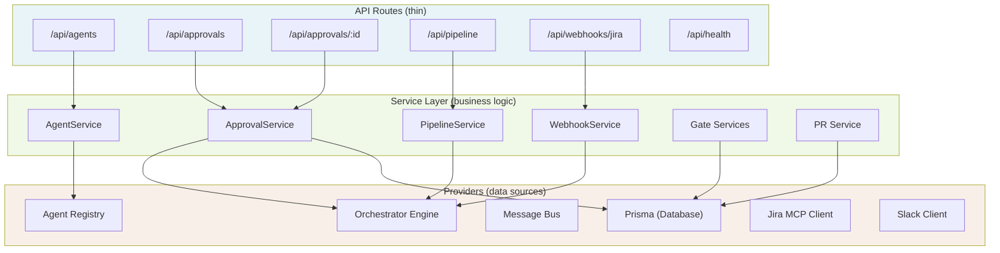
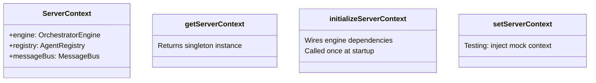

# Service Layer & API

Belva-GEN uses a three-layer architecture mandated by `.claude/rules/service-layer.md`. This document explains the layers, how they connect, and why this structure was chosen.

## Why Three Layers

Separation of concerns prevents business logic from leaking into API routes and keeps the orchestrator decoupled from HTTP concerns. This makes the system testable (services can be tested without HTTP), composable (services can be called from workers, not just routes), and maintainable (changes to API shape don't require changing business logic).

## Layer Architecture



## Layer Responsibilities

### API Routes (`src/app/api/`)

Thin handlers (<20 lines) that:
1. Extract request parameters
2. Initialize request context (via `AsyncLocalStorage`)
3. Call the appropriate service function
4. Map domain errors to HTTP status codes
5. Return a typed `ApiResponse<T>` envelope

Routes contain **no business logic**. They don't access the database, call external APIs, or make decisions.

### Services (`src/server/services/`)

Pure async functions that implement business logic. Each function:
- Receives explicit dependencies as its first argument (no global state)
- Returns domain types (not HTTP responses)
- Throws domain errors (`NotFoundError`, `ValidationError`, `GateFailedError`)

Services are **not classes** — they're exported functions. This simplifies testing (no mocking constructors) and composition.

### Providers

The data sources that services compose:
- **Orchestrator Engine** — In-memory epic state, event handling
- **Agent Registry** — Agent configurations and runtime status
- **Prisma** — Database access for approvals, pipelines, audit logs
- **MCP Clients** — Jira and Slack integrations

## ServerContext

The `ServerContext` singleton (`src/server/context.ts`) provides dependency injection. It lazily initializes providers on first access and exposes them as a typed interface.



API routes call `getServerContext()` and pass the relevant subset to service functions:

```
const context = getServerContext();
const result = await getAllAgentStatuses({ registry: context.registry });
```

This pattern means services are always testable — tests call `setServerContext()` with mocks.

**Key file:** `src/server/context.ts`

## Error Mapping

Services throw domain errors. Routes catch and map them to HTTP responses:

| Domain Error | HTTP Status | Error Code |
|-------------|-------------|------------|
| `ValidationError` | 400 | `VALIDATION_ERROR` |
| `NotFoundError` | 404 | `NOT_FOUND` |
| `GateFailedError` | 422 | `GATE_FAILED` |
| `TimeoutError` | 504 | `TIMEOUT` |
| `AgentCommunicationError` | 502 | `AGENT_COMMUNICATION_ERROR` |
| Unknown | 500 | `INTERNAL_ERROR` |

Error classes are defined in `src/lib/errors.ts`. The `ApiResponse<T>` envelope in `src/types/api-responses.ts` wraps all responses with success/error structure.

## Request Context

Request context propagates via `AsyncLocalStorage` (`src/server/config/request-context.ts`):

1. Middleware sets `x-request-id` header
2. Route reads the header and calls `runWithRequestContext()`
3. Services and providers can call `getRequestId()` for logging correlation

This enables structured logging across the entire request lifecycle without passing `requestId` through every function.

## API Endpoints

### Agent Status

| Method | Path | Service | Purpose |
|--------|------|---------|---------|
| `GET` | `/api/agents` | `getAllAgentStatuses()` | List all agents with status |
| `GET` | `/api/agents/:id` | `getAgentStatus()` | Single agent details |
| `POST` | `/api/agents/:id/heartbeat` | `updateAgentHeartbeat()` | Agent liveness signal |

### Approvals

| Method | Path | Service | Purpose |
|--------|------|---------|---------|
| `GET` | `/api/approvals` | `getPendingApprovals()` | List pending approvals (cursor-paginated) |
| `PATCH` | `/api/approvals/:id` | `approveRequest()` / `rejectRequest()` / `requestRevision()` | Take approval action |

Approval actions emit domain events to the orchestrator (`plan-approved`, `plan-rejected`, `plan-revision-requested`).

### Pipeline

| Method | Path | Service | Purpose |
|--------|------|---------|---------|
| `GET` | `/api/pipeline` | `getAllEpics()` | List all epics with progress |
| `GET` | `/api/pipeline?state=X` | `getEpicsByState()` | Filter by lifecycle state |

### Webhooks

| Method | Path | Purpose |
|--------|------|---------|
| `POST` | `/api/webhooks/jira` | Receive Jira events |

### Health

| Method | Path | Purpose |
|--------|------|---------|
| `GET` | `/api/health` | Database + Redis + executor status |

## Pagination

List endpoints use cursor-based pagination:

- `?cursor=<id>` — Start after this item
- `?limit=N` — Max items per page (capped at 100)
- Response includes `nextCursor: string | null` — null means last page

Cursor-based pagination is preferred over offset-based because it's stable when data changes between requests (new approvals arriving while paginating).

## Dashboard

The dashboard (`src/app/dashboard/`) is a Next.js App Router application with four pages:

| Page | Data Source | Components |
|------|-------------|------------|
| **Overview** | All APIs | `StatCard` molecules (active epics, pending approvals, agents online, tasks today) |
| **Agents** | `/api/agents` | `AgentStatusTable` organism |
| **Approvals** | `/api/approvals` | `ApprovalCard` organisms |
| **Pipeline** | `/api/pipeline` | `PipelineColumn` organisms (Kanban by lifecycle stage) |

### Design Principles

- **Server Components by default** — Data fetching happens server-side. Client Components only where interactivity is needed (approval buttons, form inputs).
- **Streaming with Suspense** — Each page wraps data fetches in Suspense boundaries with skeleton fallbacks for fast initial paint.
- **Semantic Tailwind tokens only** — All styling uses semantic tokens (`bg-surface`, `text-primary`). No raw color classes.
- **Atomic design** — Components organized as atoms → molecules → organisms per `.claude/rules/component-architecture.md`.

**Key directories:**
- `src/components/atoms/` — Button, Badge, Input, Text, Spinner, Avatar
- `src/components/molecules/` — StatusBadge, NavItem, FormField, StatCard
- `src/components/organisms/` — DashboardSidebar, AgentStatusTable, ApprovalCard, PipelineColumn

## Workers

BullMQ workers process queued jobs outside the request/response cycle:

| Worker | Queue | Purpose |
|--------|-------|---------|
| Webhook worker | `webhook-processing` | Process Jira events, detect GEN label, register epics |
| Notification worker | `notifications` | Send Slack messages via webhook |
| Agent task worker | `agent-tasks` | Execute agent tasks (dispatched by orchestrator) |
| Expiration checker | Repeatable job | Hourly check for expiring approvals |

Workers access the `ServerContext` singleton just like API routes, ensuring consistent dependency injection.

**Key files:**
- `src/server/workers/index.ts` — Worker implementations
- `src/server/workers/expiration-checker.ts` — Approval expiration cron
- `src/server/queues/index.ts` — Queue definitions

## Related Documents

- [System Overview](system-overview.md) — Where the service layer fits
- [Governance Model](governance-model.md) — Approval service details
- [Integration Layer](integration-layer.md) — External service clients used by services
