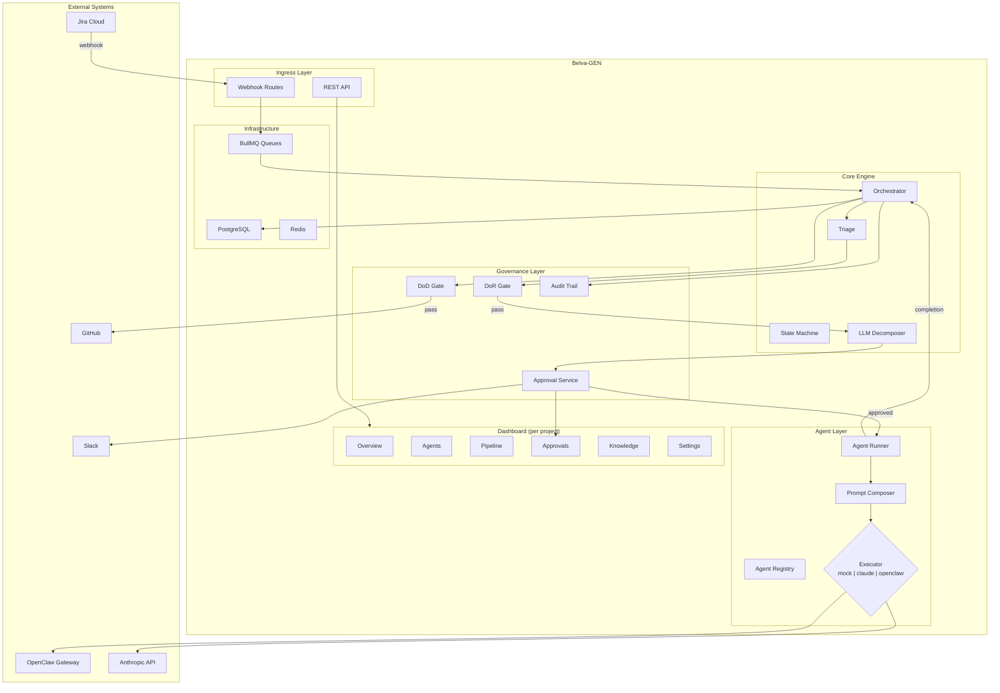

# System Overview

Belva-GEN is an autonomous development framework. It reads work from Jira, decomposes it into tasks, assigns those tasks to specialized AI agents, validates the output, and creates pull requests for human review. Humans remain in the loop at every critical decision point.

## Why This System Exists

Manual software development doesn't scale linearly with team size. Belva-GEN automates the predictable parts of the development lifecycle — ticket triage, task decomposition, code generation, test validation, PR creation — while preserving human judgment for planning approval, code review, and merge decisions.

The system supports **multiple projects**, each with its own Jira board, GitHub repo, Slack channel, and specialized agent definitions. Agents working on a Node.js codebase carry Node.js expertise; agents working on a Django codebase carry Django expertise. No cross-stack context waste. See [Multi-Project & OpenClaw](multi-project-and-openclaw.md) for details.

## System Diagram

## Core Concepts

### Pipelines

Work flows through one of three pipelines based on ticket characteristics:

| Pipeline | Trigger | Governance | Output |
| -------- | ------- | ---------- | ------ |
| **Bug** (1–2 pts) | Bug + GEN label | Simplified DoR, iterative fix loop | One PR |
| **Feature** (3–13 pts) | Feature + GEN label | Full DoR, LLM decomposition, human approval | PR per task |
| **Epic** (40+ pts) | Epic + GEN label | Full DoR, story decomposition, human approval | Coordinated PRs |

See [Pipeline Architecture](pipeline-architecture.md) for details.

### Agents

Four specialized AI agent roles, each with a bounded domain:

| Role | Domain |
| ---- | ------ |
| `orchestrator` | Task routing, Jira workflow, governance |
| `backend` | APIs, database, queues, server logic |
| `frontend` | React components, dashboard pages, UI |
| `testing` | Test files, coverage, E2E, performance budgets |

Agent definitions are project-specific. Each project repo can define its own agents in `openclaw/agents/`, specialized to that project's stack. The orchestrator loads them dynamically at runtime.

See [Agent Execution Model](agent-execution-model.md) for details.

### Governance

Every piece of work passes through quality gates:

- **Ideation Gate** — Validates problem statement and value hypothesis for early-stage ideas
- **Definition of Ready (DoR)** — Validates ticket quality before work begins
- **Human Approval** — Mandatory review of decomposition plans before execution
- **Definition of Done (DoD)** — Validates implementation quality before PR creation
- **Human Merge** — All PRs require human review and merge

See [Governance Model](governance-model.md) for details.

### Runtime Configuration

Operational parameters — approval timeouts, concurrency limits, revision cycle caps — are stored in the database and cached in Redis. They can be changed at runtime through the admin panel without redeployment.

## Layered Architecture

The server follows a three-layer pattern:

**API routes** are thin handlers (~20 lines) that parse requests, delegate to a service function, and map domain errors to HTTP status codes. They contain no business logic.

**Services** are pure async functions that implement business logic. They receive explicit dependencies, return domain types, and throw domain errors (`NotFoundError`, `ValidationError`, `GateFailedError`). Services are not classes — they're exported functions, which simplifies testing and composition.

**Providers** are the data sources that services compose: the orchestrator engine, agent registry, database (via Prisma), MCP clients, and Redis cache. A `ServerContext` singleton provides dependency injection — API routes and workers call `getServerContext()` and pass the relevant subset to service functions.

## Technology Choices

| Choice | Why |
| ------ | --- |
| **Next.js App Router** | Unified framework for dashboard UI + API routes; server components minimize JS bundle |
| **BullMQ** | Reliable async processing with retry/DLQ; decouples webhook ingestion from processing |
| **Zod** | Runtime type safety at system boundaries; validates all external data |
| **OpenClaw** | MCP tool access, workspace isolation, and model routing for production agent execution |
| **Anthropic Claude** | Powers task decomposition and agent execution; direct API path for dev/fallback |
| **PostgreSQL + Prisma** | Structured data for pipelines, approvals, audit trail; type-safe queries |
| **Redis** | BullMQ backing store, rate limiting, session cache, config cache |

## Related Documents

- [Pipeline Architecture](pipeline-architecture.md) — How work flows from ticket to PR
- [Agent Execution Model](agent-execution-model.md) — How agents are dispatched and execute
- [Governance Model](governance-model.md) — Gates, approvals, and audit trail
- [Integrations & Infrastructure](integrations-and-infrastructure.md) — External systems and deployment
- [Multi-Project & OpenClaw](multi-project-and-openclaw.md) — Multi-project support and OpenClaw integration
