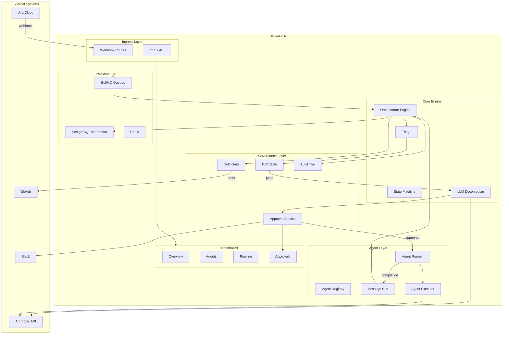

# System Overview

Belva-GEN is an autonomous development framework. It reads work from Jira, decomposes it into tasks, assigns those tasks to specialized AI agents, validates the output, and creates pull requests for human review. Humans remain in the loop at every critical decision point.

## Why This System Exists

Manual software development doesn't scale linearly with team size. Belva-GEN automates the predictable parts of the development lifecycle — ticket triage, task decomposition, code generation, test validation, PR creation — while preserving human judgment for planning approval, code review, and merge decisions.

## System Diagram



## Core Concepts

### Pipelines

Work flows through one of three pipelines based on ticket characteristics:

| Pipeline | Trigger | Planning Gate | Agents | Output |
|----------|---------|---------------|--------|--------|
| **Bug** (1-2 pts) | Bug + GEN label + low points | Simplified DoR | Single agent | One PR |
| **Feature** (3-13 pts) | Feature + GEN label | Full DoR + LLM decomposition + human approval | Multi-agent parallel | PR per task |
| **Epic** (40+ pts) | Epic + GEN label | Full DoR + decomposition into stories + human approval | Coordinated multi-agent | PR per task, sequenced merges |

See [Pipeline Architecture](pipeline-architecture.md) for details.

### Agents

Four specialized AI agents, each with a bounded domain:

| Agent | Domain | Owned Paths |
|-------|--------|-------------|
| `orchestrator-project` | Task routing, docs, orchestration | Project-wide |
| `node-backend` | APIs, database, queues, MCP | `src/server/`, `src/app/api/`, `prisma/` |
| `next-ux` | React, UI, dashboard | `src/app/dashboard/`, `src/components/` |
| `ts-testing` | Tests, coverage, budgets | `__tests__/`, `e2e/` |

Agents are defined in `.claude/agents/*.md`. These markdown files serve as both documentation and system prompts for the LLM executor.

See [Agent Execution Model](agent-execution-model.md) for details.

### Governance

Every piece of work passes through quality gates:

- **Definition of Ready (DoR)** — Validates ticket quality before work begins
- **Human Approval** — Mandatory review of decomposition plans before execution
- **Definition of Done (DoD)** — Validates implementation quality before PR creation
- **Human Merge** — All PRs require human review and merge

See [Governance Model](governance-model.md) for details.

## Technology Choices

| Choice | Why |
|--------|-----|
| **Next.js App Router** | Unified framework for dashboard UI + API routes; server components minimize JS bundle |
| **BullMQ** | Reliable async processing with retry/DLQ; decouples webhook ingestion from processing |
| **Zod** | Runtime type safety at system boundaries; validates all external data (Jira, LLM, webhooks) |
| **Anthropic Claude** | Powers both task decomposition and agent execution; chosen for consistency with Claude Code ecosystem |
| **PostgreSQL + Prisma** | Structured data for pipelines, approvals, audit trail; Prisma provides type-safe queries |
| **Redis** | BullMQ backing store, rate limiting, session cache |

## Key Directories

```
src/server/orchestrator/    # Core engine, state machine, triage, decomposition, pipelines
src/server/agents/          # Registry, runner, message bus, execution layer
src/server/services/        # Business logic (gates, approval, pipeline, webhook, PR)
src/server/mcp/             # Jira and Slack integration clients
src/app/api/                # Thin API routes delegating to services
src/app/dashboard/          # Human-in-the-loop dashboard UI
src/types/                  # Shared Zod schemas (gates, events, agent protocol)
.claude/agents/             # Agent definitions (also serve as LLM system prompts)
.claude/rules/              # Path-specific rules auto-applied to agents
```

## Related Documents

- [Pipeline Architecture](pipeline-architecture.md) — How work flows from ticket to PR
- [Agent Execution Model](agent-execution-model.md) — How agents are dispatched and execute
- [Governance Model](governance-model.md) — Gates, approvals, and audit trail
- [Integration Layer](integration-layer.md) — Jira, Slack, and GitHub integrations
- [Service Layer & API](service-layer-api.md) — Three-layer architecture and API design
- [Deployment Architecture](../deployment-architecture.md) — AWS infrastructure
